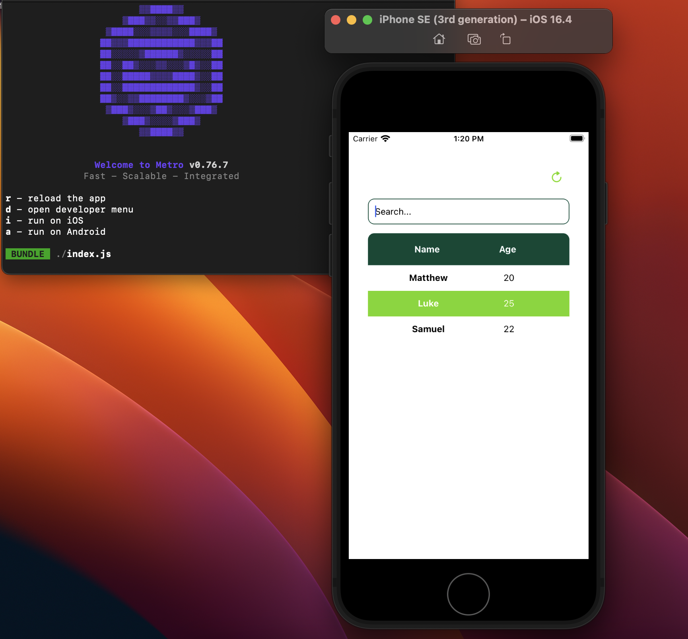
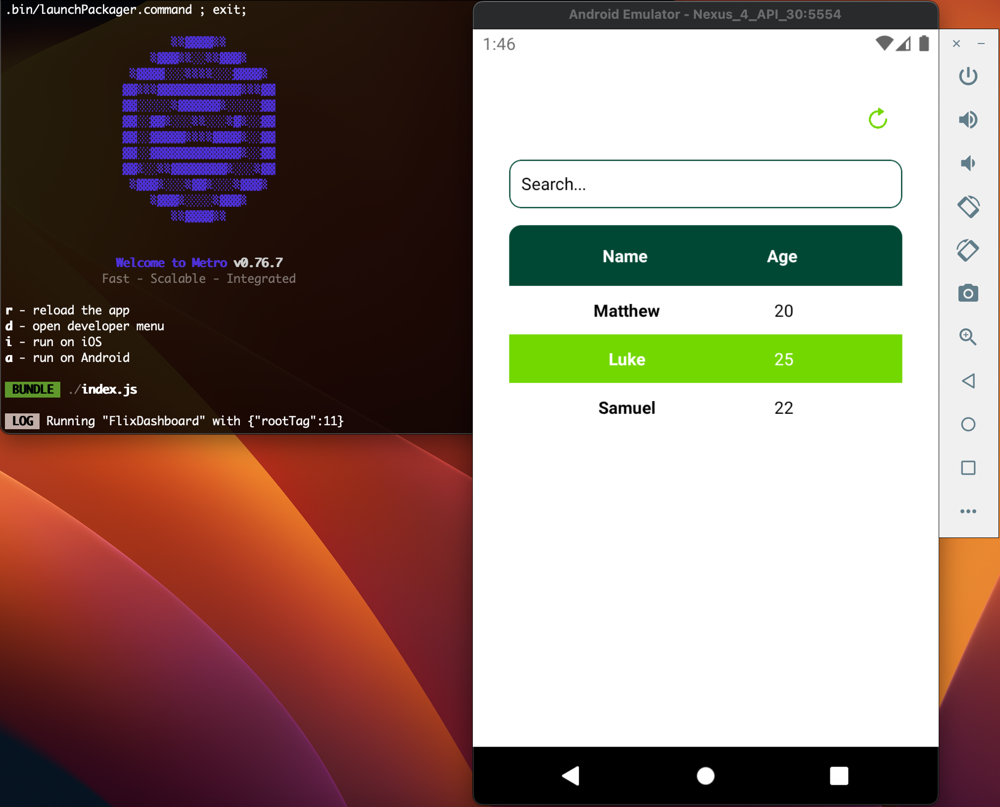

# Flix Dashboard

## Prerequisites

>**Note**: Make sure you have completed the [React Native - Environment Setup](https://reactnative.dev/docs/environment-setup) instructions till "Creating a new application" step, before proceeding.

## Installation

1. Clone the repo: `git@github.com:pyshchyk-o/FlixDashboard.git`
2. Navigate to the cloned repository: `cd FlixDashboard`
3. Install dependencies: `yarn`
4. For iOS, install pods: `cd ios && pod install` or `cd ios && npx pod-install`
5. Return to the root directory: `cd ..`
6. To run the app in an Android emulator, use the command: `yarn android`
7. To run the app in an iOS emulator, use the command: `yarn ios`

>**Note for Android**: When using the Android emulator, if the app can't connect to the bundler, you might need to use the adb reverse command to ensure that the emulator can access the bundler via the localhost:8081. Run the following command:
> ``adb reverse tcp:8081 tcp:8081``. Alternatively, you can change the bundle location in the emulator to use your machine's IP address instead of localhost. To do this, open the Developer menu in the emulator.

## Features

- Fetching and displaying user data from a mock API.
- Data caching in AsyncStorage with an expiry time.
- Refreshing cached data.
- A reusable SortableTable component for displaying data with sorting functionality.
- Reusable custom hooks for fetching, caching data (**useCachedData**), and handling state management (**useUsersData**).
- Tests for AsyncStorage caching.

## App screenshots

